# STCell
Hippocampal neurons encode both spatial location (place cells) and elapsed time (time cells), to support episodic memory and spatial cognition. However, existing models explain these two phenomena using fundamentally different mechanisms: place cells emerge from continuous attractor dynamics, while time cells are often modeled as leaky integrators. This separation leaves unresolved how both representations arise within the same recurrent circuit, particularly in hippocampal CA3. We propose that place cells and time cells are two dynamical regimes of a single recurrent network. Both representations arise from hippocampal reconstruction of sensory experience, but different sensory structures give rise to distinct representational regimes.

## Table of Contents

- [Install](#install)
- [Start from here](#start-from-here)
  - [Figure 2A (Time cell)](#figure-2a-time-cell)
  - [Figure 2B (Place cell in square room)](#figure-2b-place-cell-in-square-room)
  - [Figure 3A (Place cell in circular track)](#figure-3a-place-cell-in-circular-track)
  - [Figure 3B (Place + Time cell in circular track)](#figure-3b-place-time-cell-in-circular-track)
  - [Figure 4](#figure-4)
  - [Figure 5](#figure-5)
  - [Figure 6](#figure-6)
- [Acknowledgement](#acknowledgement)

## Install

In order to run the simulations, clone the current repository and then install [nn4n](https://github.com/NN4Neurosim/nn4n):

```bash
git clone https://github.com/qrsyu/STCell.git
cd STCell/code
git clone --single-branch --branch v1.2.1 https://github.com/NN4Neurosim/nn4n.git 
cd nn4n
pip install -e .
```
This repository also requires common Python packages such as `scikit-learn`, `seaborn`, `torch`, `numpy`, `matplotlib`, and `jupyter`.

## Start from here
Make sure the working directory is `~/STCell/`, for example:
```bash
(myenv) name@ip STCell %  
```
### Figure 2A (Time cell)

Open `code/time_exp/2TS.ipynb` and click `Run All`. This script will generate the hidden states data and model weights for later visualization. 

Then run 
```bash
(myenv) name@ip STCell % python3 code/2TS_fig.py
```
to generate Figure 2A. 

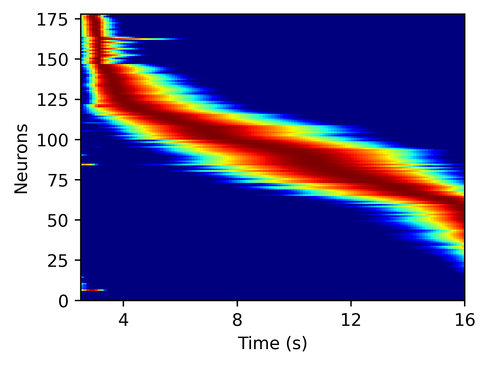 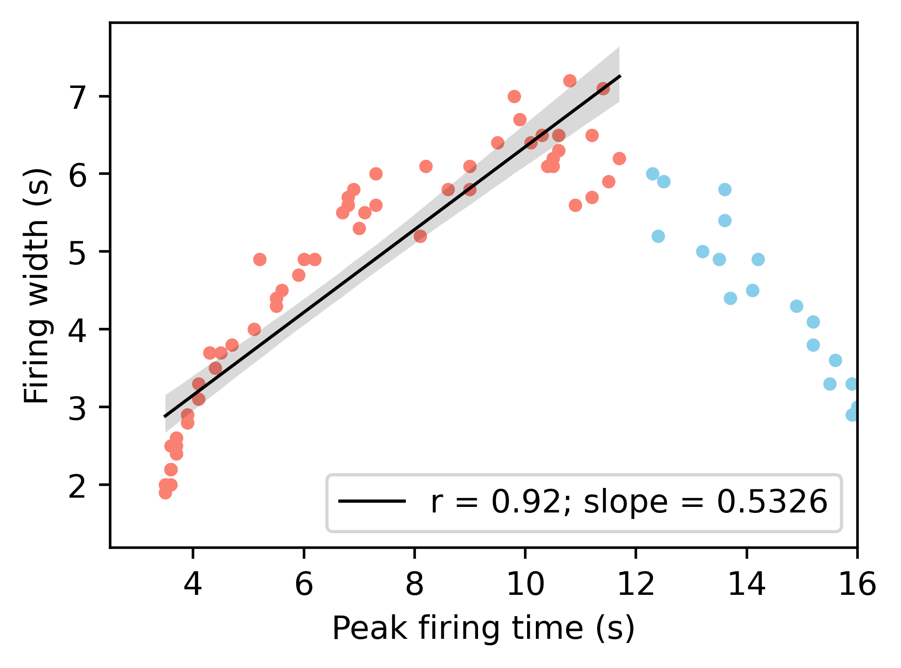

### Figure 2B (Place cell in square room)

Open `code/sq_space_exp/square_room.ipynb` and click `Run All`. This script generates the hidden states data and model weights for later visualization. 

Then run 
```bash
(myenv) name@ip STCell % python3 code/plot_place_cells.py --load_data square_room --data_type npz
```
to plot individual place fields which are saved in `fig-place-cells/square_room_512/ratemap_time0_-1/`. 

### Figure 3A (Place cell in circular track)

Open `code/space_exp/2WSMS.ipynb` and click `Run All`. This script generates the hidden states data and model weights for later visualization. 

Then run 
```bash
(myenv) name@ip STCell % python3 code/plot_place_cells.py --load_data 2WSMS --data_type npy
```
to plot individual place fields which are saved in `fig-place-cells/2WSMS_512/ratemap_time0_-1/`. 

### Figure 3B (Place + Time cell in circular track)

Run `code/spacetime_exp/2WSMS_mask.py`. This script generates the data required for training. 

Then open `code/spacetime_exp/2WSMS_mask.ipynb` and click `Run All`. This script generates the hidden states data, model weights and Fig 3B ii. 

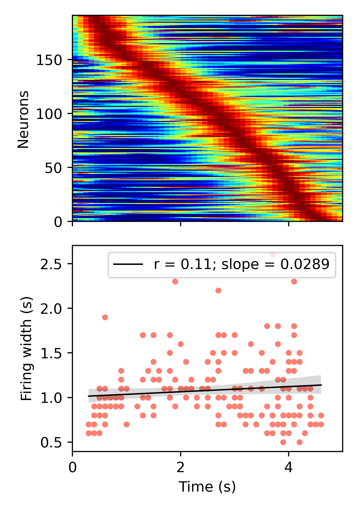 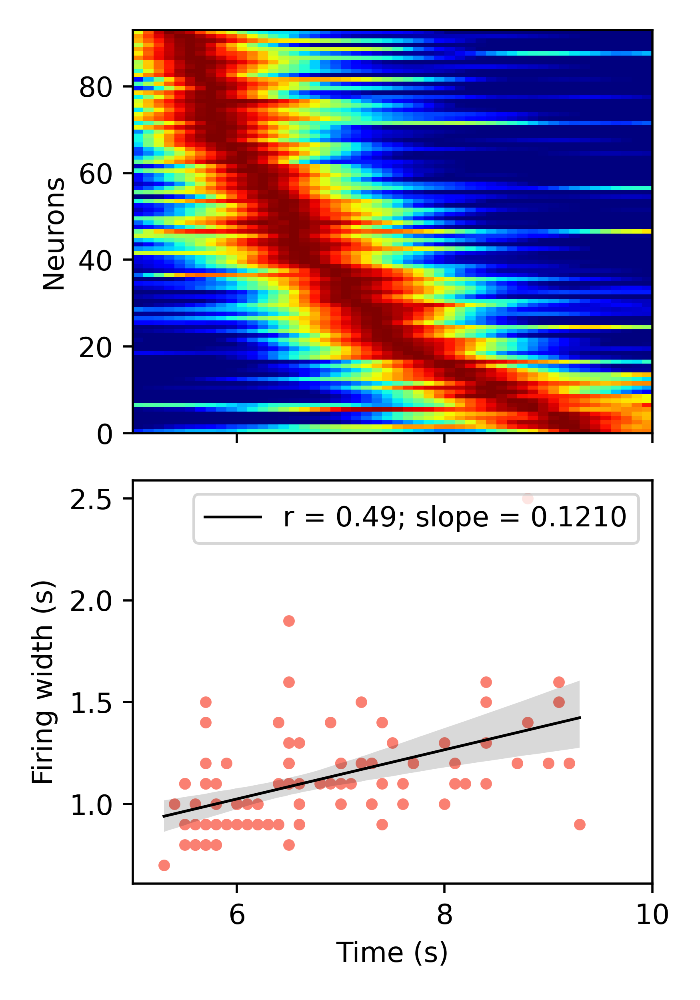

run 
```bash
(myenv) name@ip STCell % python3 code/plot_place_cells.py --load_data 2WSMS_mask --data_type npy
(myenv) name@ip STCell % python3 code/plot_place_cells.py --load_data 2WSMS_mask --data_type npy --time_end 50
(myenv) name@ip STCell % python3 code/plot_place_cells.py --load_data 2WSMS_mask --data_type npy --time_start 50
```
to plot individual place fields which are saved in `fig-place-cells/2WSMS_mask_512/ratemap_time0_-1/`, `fig-place-cells/2WSMS_mask_512/ratemap_time0_50/` and `fig-place-cells/2WSMS_mask_512/ratemap_time50_-1/`. 

### Figure 4

Run `code/repre_transit_exp/2TS_varylength.py`

Run `code/repre_transit_exp/2WSMS_mask_varylength.py`

To generate FIg 4A ii and Fig 4B ii, run 
```bash
(myenv) name@ip STCell % python3 code/fig/fig4_bar.py
(myenv) name@ip STCell % python3 code/fig/fig4B_bar.py
```

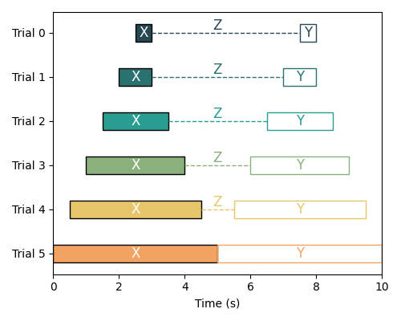 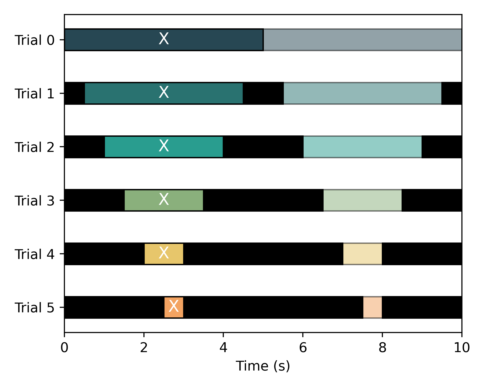

### Figure 5

Open `code/repre_transit_exp/2TS2WSMS_sensory.ipynb` and click `Run All`. Then run `code/repre_transit_exp/2TS2WSMS.py`

To generate FIg 5B and Fig 5C, run 
```bash
(myenv) name@ip STCell % python3 code/fig/fig5_bar.py
(myenv) name@ip STCell % python3 code/fig/fig5_hist.py
```

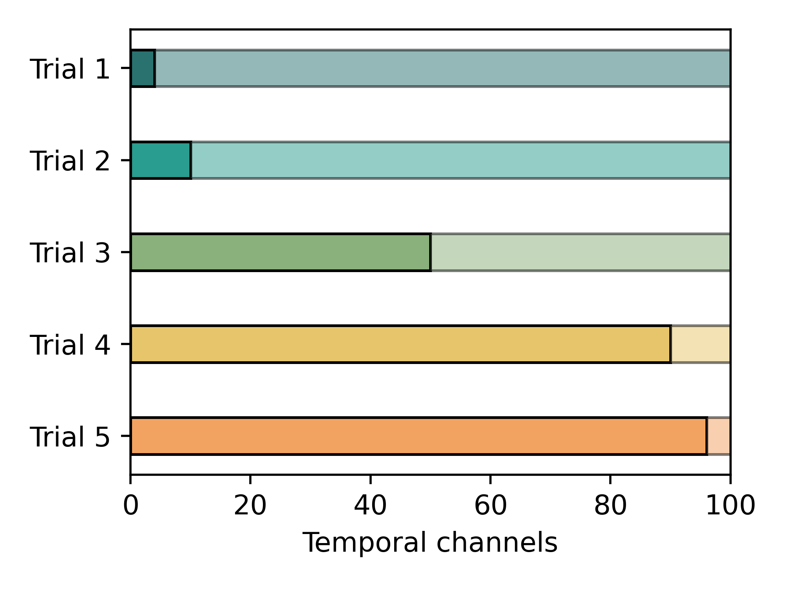 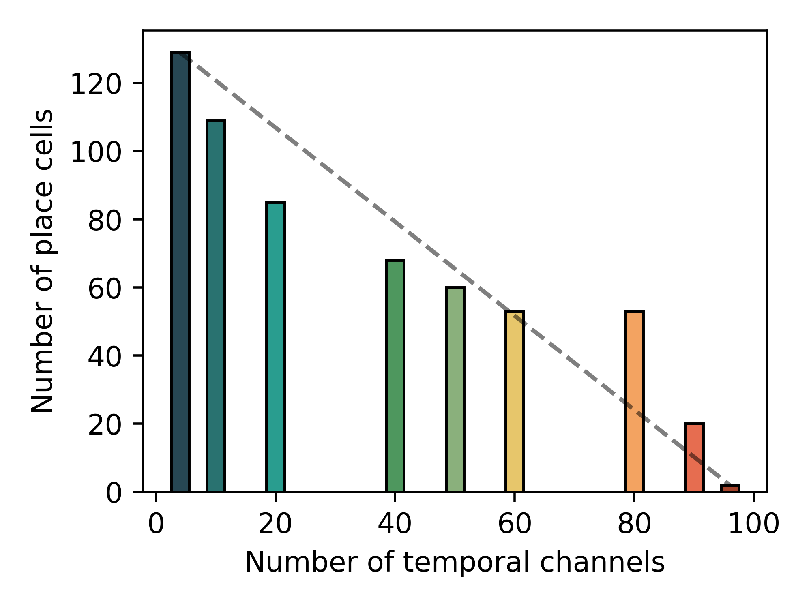

### Figure 6

Open `code/theory_exp/sanity_check.ipynb` and click `Run All` to generate Fig 6A.

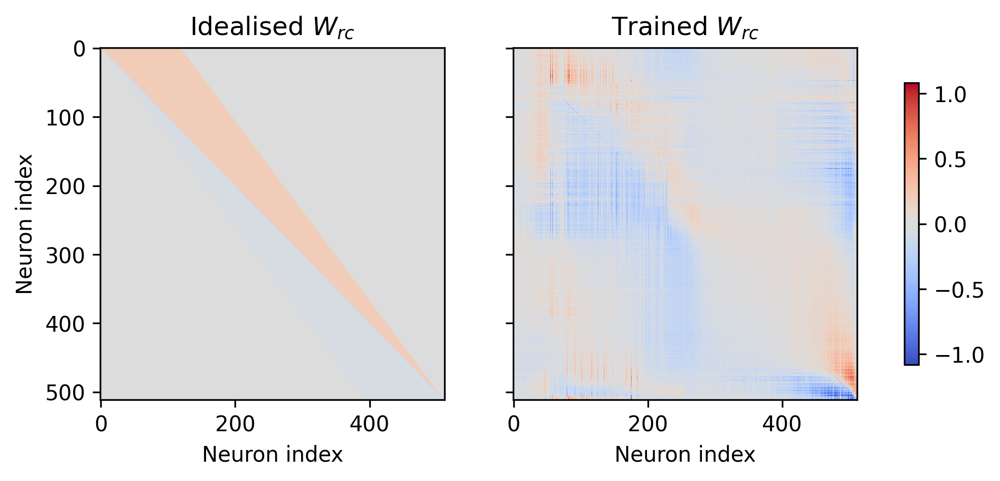

Open `code/theory_exp/test_RNN.ipynb` and click `Run All` to generate Fig 6B-D. 

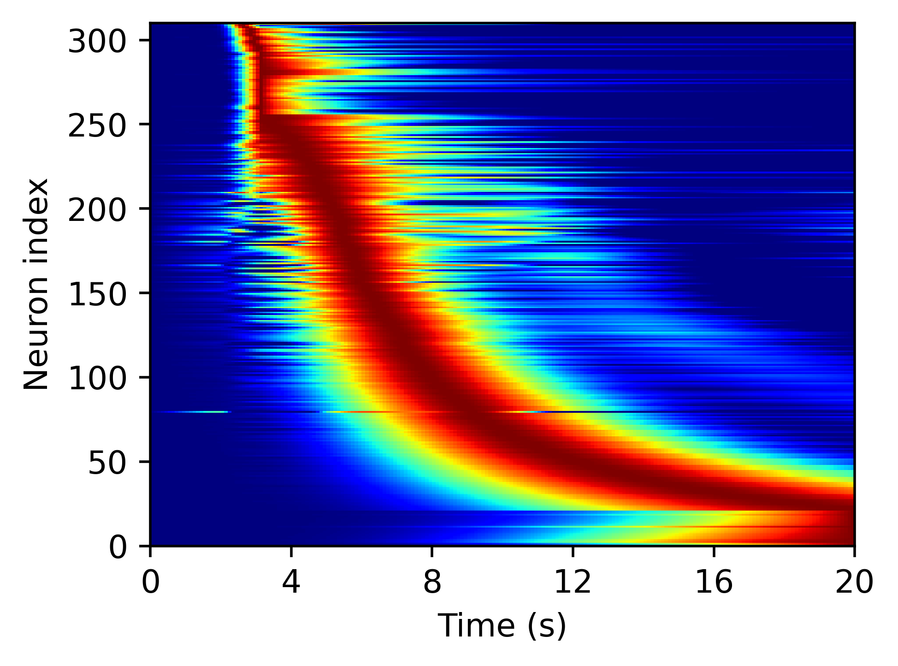 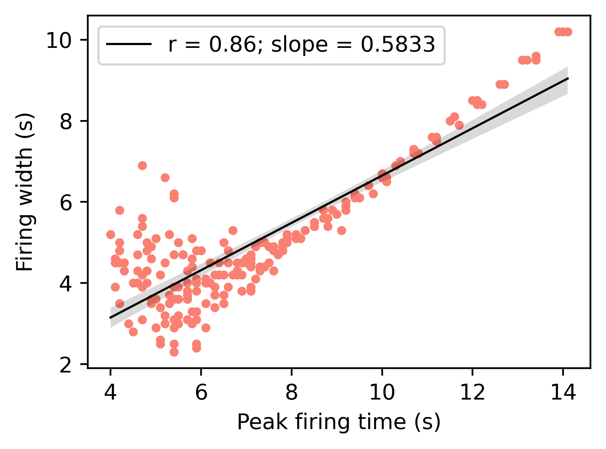

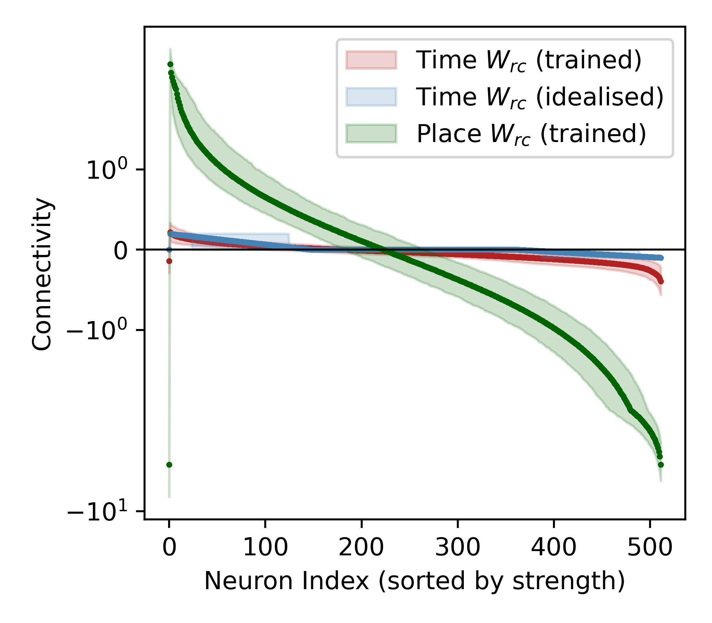 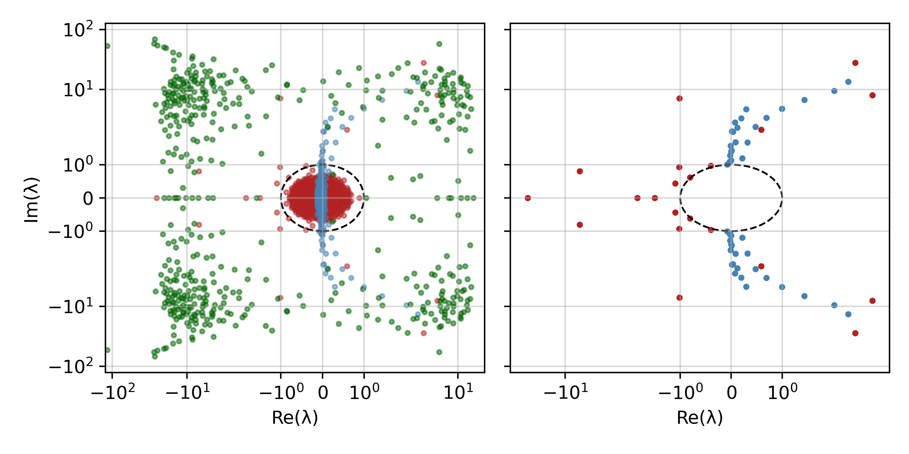 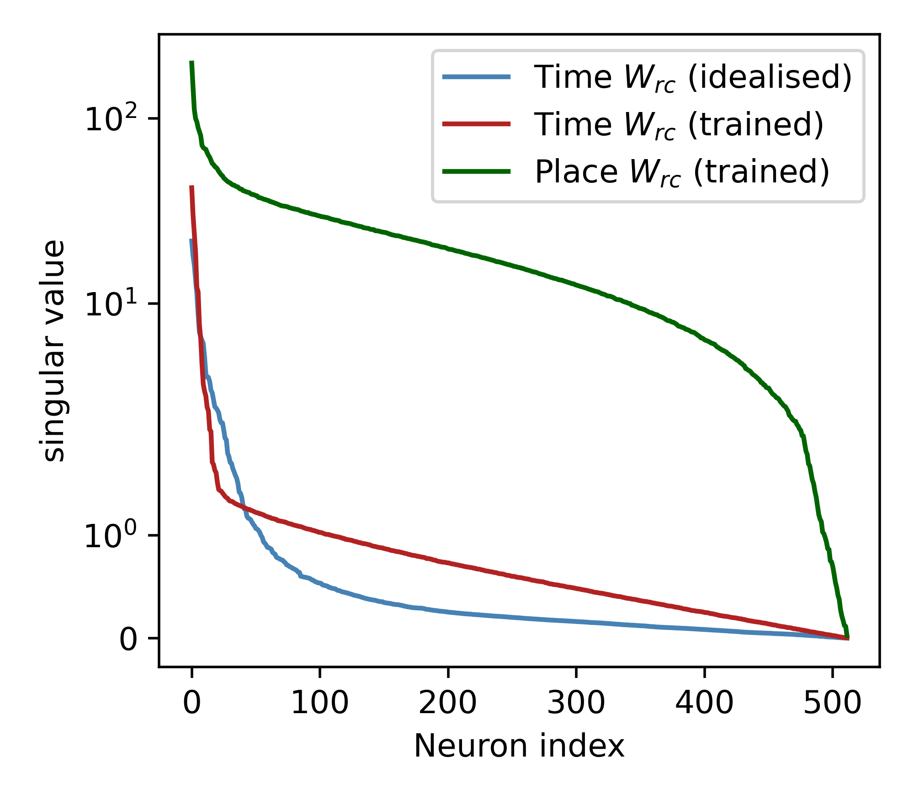

Open `code/theory_exp/high_dim_dist.ipynb` and click `Run All` to generate Fig 6F.

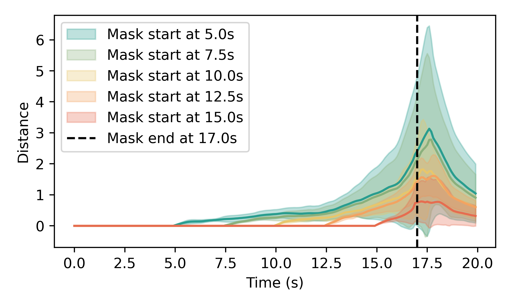

## Acknowledgement

Parts of the code in `../code/rtgym/` are adapted from the original 
[RatatouGym](https://github.com/zhaozewang/rtgym) repository. 
We thank the authors for open-sourcing their implementation.

If you use this repository, please also cite the original work:

```bibtex
@article{wang2024time,
  title={Time makes space: Emergence of place fields in networks encoding temporally continuous sensory experiences},
  author={Wang, Zhaoze and Di Tullio, Ronald W and Rooke, Spencer and Balasubramanian, Vijay},
  journal={Advances in Neural Information Processing Systems},
  volume={37},
  pages={37836--37864},
  year={2024}
}
```