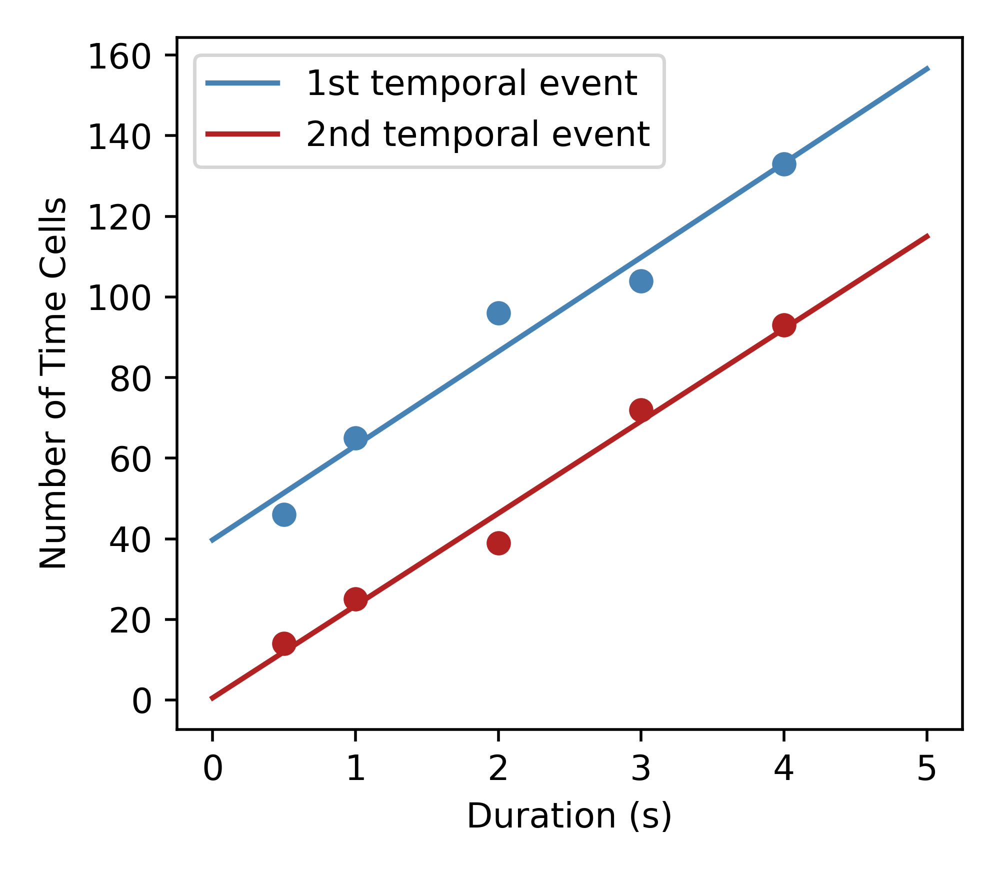
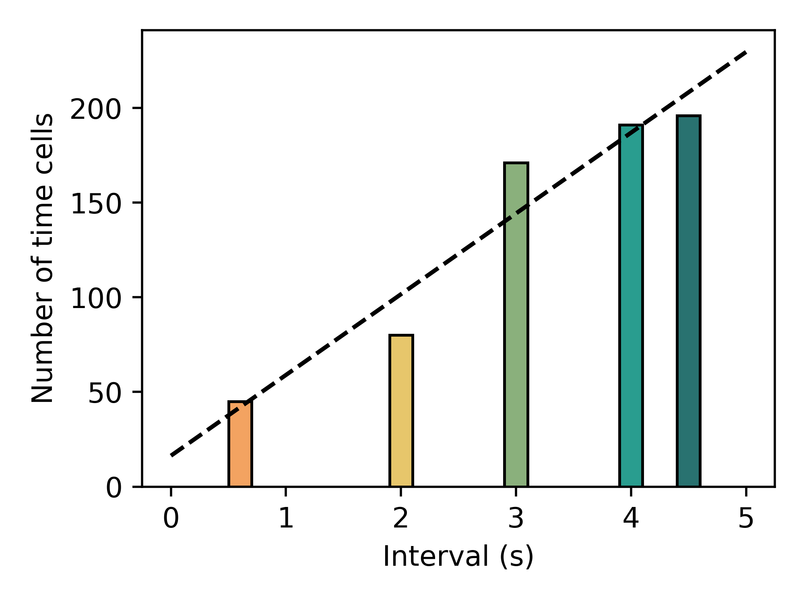
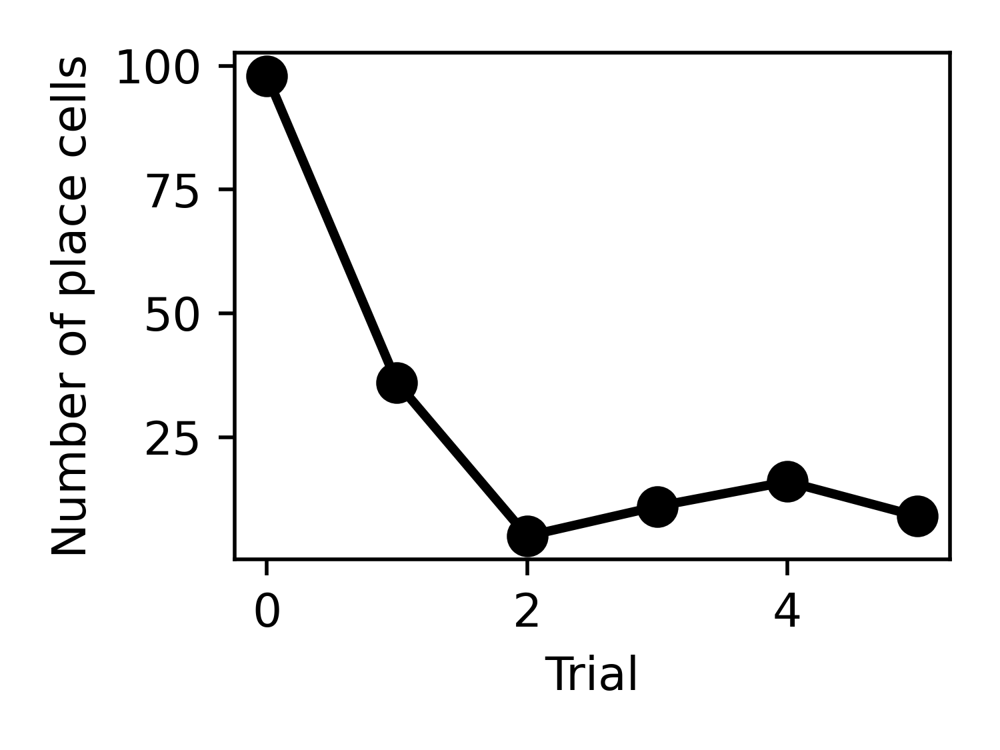
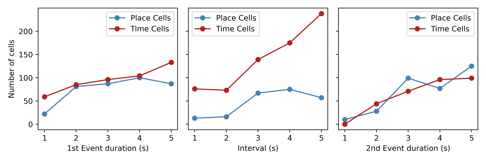

# STCell
Hippocampal neurons encode both spatial location (place cells) and elapsed time (time cells), to support episodic memory and spatial cognition. However, existing models explain these two phenomena using fundamentally different mechanisms: place cells emerge from continuous attractor dynamics, while time cells are often modeled as leaky integrators. This separation leaves unresolved how both representations arise within the same recurrent circuit, particularly in hippocampal CA3. We propose that place cells and time cells are two dynamical regimes of a single recurrent network. Both representations arise from hippocampal reconstruction of sensory experience, but different sensory structures give rise to distinct representational regimes.

## Table of Contents

- [Install](#install)
- [Repository Layout](#repository-layout)
- [Download Data](#download-data)
- [Run the Experiments](#run-the-experiments)
  - [Figure 2A (Time cell)](#figure-2a-time-cell)
  - [Figure 2B (Place cell in square room)](#figure-2b-place-cell-in-square-room)
  - [Figure 3A (Place cell in circular track)](#figure-3a-place-cell-in-circular-track)
  - [Figure 3B (Place + Time cell in circular track)](#figure-3b-place-time-cell-in-circular-track)
  - [Figure 4](#figure-4)
  - [Figure 5](#figure-5)
  - [Figure 6](#figure-6)
- [Acknowledgement](#acknowledgement)

## Install

In order to run the simulations, clone the current repository and then install [nn4n](https://github.com/NN4Neurosim/nn4n):

```bash
git clone https://github.com/qrsyu/STCell.git
cd STCell/code
git clone --single-branch --branch v1.2.1 https://github.com/NN4Neurosim/nn4n.git 
cd nn4n
pip install -e .
```
This repository also requires common Python packages such as `scikit-learn`, `seaborn`, `torch`, `numpy`, `matplotlib`, and `jupyter`.

## Repository Layout

All commands in this README assume the repository root, `STCell/`, unless stated otherwise.

Download the data and place it in `STCell/data/`, `STCell/model/`, and `STCell/fig-place-cells/`. The repository layout should be like:

- `code/`: scripts, notebooks, and figure-generation utilities
- `data/`: saved datasets used by the experiments
- `model/`: pretrained weights
- `fig-place-cells/`: place-field outputs generated by the plotting scripts

## Run the Experiments

Make sure the working directory is the repository root, for example `~/STCell/`.

### Figure 2A (Time cell)

Open `code/time_exp/2TS.ipynb` from the repository root and click `Run All`. This notebook generates the hidden-state data and model weights used for later visualization.

Then run:

```bash
python3 code/2TS_fig.py
```

 

### Figure 2B (Place cell in square room)

Open `code/sq_space_exp/square_room.ipynb` from the repository root and click `Run All`. This notebook generates the hidden-state data and model weights used for later visualization.

Then run:

```bash
python3 code/plot_place_cells.py --load_data square_room --data_type npz
```
This generates individual place fields and saves them in `fig-place-cells/square_room_512/ratemap_time0_-1/`.

### Figure 3A (Place cell in circular track)

Open `code/space_exp/2WSMS.ipynb` from the repository root and click `Run All`. This notebook generates the hidden-state data and model weights used for later visualization.

Then run:

```bash
python3 code/plot_place_cells.py --load_data 2WSMS --data_type npy
```
This generates individual place fields and saves them in `fig-place-cells/2WSMS_512/ratemap_time0_-1/`.

### Figure 3B (Place + Time cell in circular track)

From the repository root, run:

```bash
python3 code/spacetime_exp/2WSMS_mask.py
```

This script generates the data required for training.

Then open `code/spacetime_exp/2WSMS_mask.ipynb` from the repository root and click `Run All`. This notebook generates the hidden-state data, model weights, and Fig. 3Bii.

 

Then run:

```bash
python3 code/plot_place_cells.py --load_data 2WSMS_mask --data_type npy --time_end 50
python3 code/plot_place_cells.py --load_data 2WSMS_mask --data_type npy --time_start 50
```
These commands generate individual place fields and save them in`fig-place-cells/2WSMS_mask_512/ratemap_time0_50/`, and `fig-place-cells/2WSMS_mask_512/ratemap_time50_-1/`.

### Figure 4A 

The simulation data for Fig 4A is pre-generated and saved as `STCell/data/2TS_varyN.npy` and the script for simulation is 
```bash
python3 code/repre_transit_exp/2TS_vary.py
```
You can modify <tt>trial</tt>, <tt>X</tt>, <tt>Y</tt>, and <tt>width</tt> according to the table in the script to re-generate the data. 

To generate Fig 4A iii, uncomment line <u>22-25</u> in `code/fig/fig_temp_fr.py`, and run it. 

To generate Fig 4A iv, open `code/fig/fig4_time_cell_corr_events.ipynb` and `code/fig/fig4_time_cell_corr_time_interval.ipynb` click `Run All`.

 

### Figure 4B

The simulation data for Fig 4B is pre-generated and saved as `STCell/data/2WSMS_mask_varyN.npy` and the script for simulation is 
```bash
python3 code/repre_transit_exp/2WSMS_mask_vary.py
```
You can modify <tt>trial</tt>, <tt>X</tt>, <tt>Y</tt>, and <tt>width</tt> according to the table in the script to re-generate the data. 

To generate Fig 4B iii, uncomment line <u>30-33</u> in `code/fig/fig_temp_fr.py`, and run it. 

To generate Fig 4B iv, run
```bash
python3 code/fig/fig4_place_cells.py
```
To generate Fig 4B v, open `code/fig/fig4_time_place.ipynb` and click `Run All`.

 

### Figure 5

The simulation data for Fig 5 is pre-generated and saved as `STCell/data/2TS2WSMS_varyN.npy` and the script for simulation is 

```bash
python3 code/repre_transit_exp/2TS2WSMS_vary.py
```
You can modify the <tt>chose_idx</tt> in the script to re-generate the data. 

To generate Fig. 5, uncomment line <u>12-17</u> in `code/fig/fig_temp_fr.py`, and then run 

```bash
python3 code/fig/fig5_hist.py
python3 code/fig/fig_temp_fr.py
python3 code/fig/fig_temp_corr.py
```

### Figure 6

Open `code/theory_exp/sanity_check.ipynb` from the repository root and click `Run All` to generate Fig. 6A.


Open `code/theory_exp/test_RNN.ipynb` from the repository root and click `Run All` to generate Fig. 6B-D.

 

  

Open `code/theory_exp/high_dim_dist.ipynb` from the repository root and click `Run All` to generate Fig. 6F.


## Acknowledgement

Parts of the code in `../code/rtgym/` are adapted from the original 
[RatatouGym](https://github.com/zhaozewang/rtgym) repository. 
We thank the authors for open-sourcing their implementation.

If you use this repository, please also cite the original work:

```bibtex
@article{wang2024time,
  title={Time makes space: Emergence of place fields in networks encoding temporally continuous sensory experiences},
  author={Wang, Zhaoze and Di Tullio, Ronald W and Rooke, Spencer and Balasubramanian, Vijay},
  journal={Advances in Neural Information Processing Systems},
  volume={37},
  pages={37836--37864},
  year={2024}
}
```